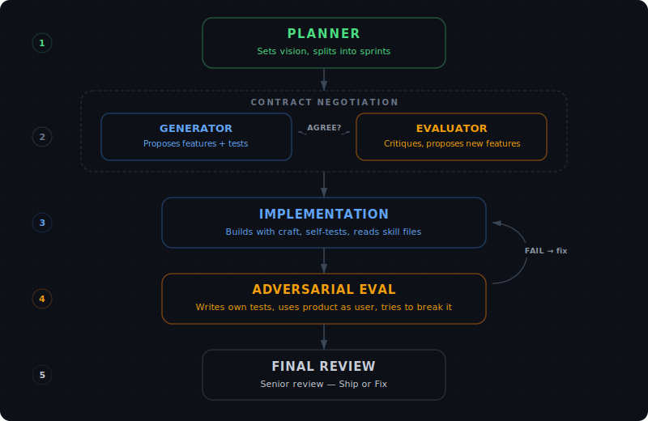
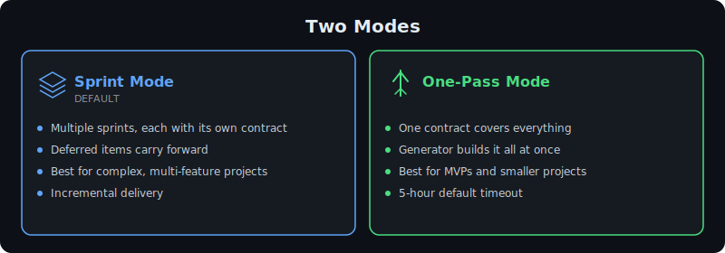
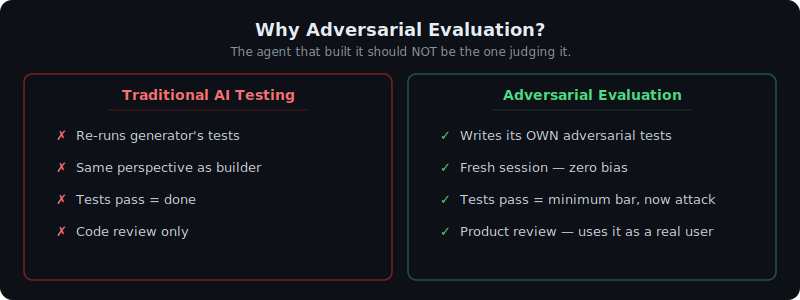

<div align="center">

# HARNESS CLAUDE CODE

**Negotiate. Build. Attack. Ship.**

An adversarial multi-agent orchestration system for [Claude Code](https://claude.ai/code).
Two AI agents negotiate contracts, build software, and try to break each other's work — so you don't have to.

[](LICENSE)
[](https://python.org)
[](https://claude.ai/code)

</div>

---

## Why This Exists

Most AI coding tools follow the same pattern: you tell the AI what to build, it builds it, you check if it's right. The problem? **The AI that built it is the same AI evaluating it.** It's grading its own homework.

Harness Claude Code takes a different approach — inspired by [Anthropic's harness design research](https://www.anthropic.com/engineering/harness-design-long-running-apps) and adversarial debate architectures like [TradingAgents](https://github.com/TauricResearch/TradingAgents):

> **Separate the agent doing the work from the agent judging it.**

Two agents with opposing objectives. A **Generator** that builds with creativity and craft. An **Evaluator** that attacks with hostility and rigor. They negotiate before any code is written. They fight about what "done" means. And only when both agree does anything ship.

---

## How It Works

<div align="center">

</div>

---

## Two Modes

<div align="center">

</div>

---

## Quick Start

### Prerequisites

- **Python 3.10+**
- **Claude Code CLI** — installed and authenticated ([install guide](https://claude.ai/code))
- **Git** — for state tracking and rollback

### Install

```bash
git clone https://github.com/andywxy1/harness-claude-code.git
cd harness-claude-code
pip install -e .
```

### Run

```bash
# Web UI (recommended) — opens mission control at http://localhost:8420
harness-claude

# CLI with web monitoring
harness-claude "Build a real-time chat app" -w ./my-project

# One-pass mode
harness-claude "Build a Pomodoro timer" --mode onepass -w ./timer

# Console only
harness-claude "Build a REST API" --no-web -w ./api

# Resume a crashed project
harness-claude --resume -w ./my-project
```

On first launch, the **onboarding flow** scans your installed Claude Code plugins and lets you select which skills and agents are available to the Generator and Evaluator.

---

## The Web UI

A real-time mission control interface that streams everything the agents do.

### What You See

| Panel | Shows |
|-------|-------|
| **Sprint Bar** | Progress across all sprints — which is active, which are done |
| **Phase Pipeline** | Negotiation rounds, implementation cycles, eval results in the sidebar |
| **Chat Bubbles** | Generator and Evaluator messages with rendered markdown, back-and-forth |
| **Tool Activity** | Real-time tool calls — which files agents are reading, writing, running |
| **Contract Tab** | The agreed sprint contract with all features, criteria, and tests |
| **Eval Report** | Test checklist (pass/fail per item) + adversarial findings + manual UX review |
| **Event Log** | Raw debug stream of every event |
| **Token Tracker** | Running cost: input/output tokens and USD spent |
| **Settings** | Model per role (Opus/Sonnet/Haiku), timeouts, negotiation caps |

### Controls

- **Launch** — start a new project with prompt + workspace + mode selection
- **Resume** — select a workspace with saved state, continue where you left off
- **Browse** — native macOS folder picker for workspace selection
- **Stop** — halt execution after the current agent finishes
- **Settings** — configure models and timeouts per phase

---

## What Makes the Evaluator Different

Most AI testing is a rubber stamp. The agent runs its own tests, they pass, it says "done." Our evaluator is designed to be **adversarial**:

<div align="center">

</div>

The evaluator is told: *"If all your findings are things the generator already tested, you have failed at your job."*

---

## Contract Negotiation

Before any code is written, the Generator and Evaluator negotiate a **sprint contract** — a legally binding (to them) document that defines:

- **Features** with unambiguous descriptions
- **Acceptance criteria** with exact values (status codes, error messages, pixel breakpoints)
- **Tests** with function signatures describing setup → action → assertion
- **Out of scope** — deferred items that carry forward to future sprints

The Evaluator can **propose new features** as a user advocate. The Generator can accept, reject with reasoning, or defer. Both must say AGREED — there's no veto power and no max rounds.

The contract is the law. Tests are written before code. Both agents verify independently.

---

## Skill & Agent Registry

On first launch, Harness Claude Code scans your installed Claude Code plugins:

- **Skills** — expert instruction files (design, animation, typography, TDD, debugging)
- **Agents** — specialized sub-agents from plugins like CEO (170+ agents across 13 domains)

You select which skills and agents are available. The Generator reads skill files before implementation (e.g., reads the `frontend-design` skill before writing any HTML/CSS). The agents run in headless mode — they read skill files via the Read tool and apply guidelines in one pass.

---

## Architecture

```
harness/
├── cli.py                  # Entry point
├── orchestrator.py         # Sprint sequencing, one-pass mode, resume
├── planner.py              # Splits project into sprint themes
├── negotiation.py          # Generator-Evaluator contract negotiation
│                           #   Sprint 2+: parallel codebase exploration
├── implementation.py       # Build/test cycles with rollback
├── review.py               # Final codebase review
├── scanner.py              # Discovers skills + agents from all plugins
├── config.py               # Models, timeouts, selections (persisted)
├── state.py                # Atomic project state persistence
├── claude_session.py       # Claude Code CLI wrapper (streaming + resume)
├── events.py               # Event bus + audit log
├── utils.py                # Git, parsing, file helpers
├── web.py                  # FastAPI + WebSocket server
├── static/
│   ├── index.html          # Mission control UI
│   └── onboarding.html     # Skill/agent selection
└── prompts/
    ├── contract_criteria.py  # Shared contract quality rubric
    ├── planner.py            # Planner system prompt
    ├── negotiation.py        # Negotiation prompts (gen + eval)
    ├── implementation.py     # Build + adversarial eval prompts
    └── review.py             # Final review prompt
```

### Key Design Decisions

| Decision | Why |
|----------|-----|
| **Persistent generator, fresh evaluator** | Generator remembers what it tried. Evaluator has no bias. |
| **Contract-as-law** | Tests before code. Both sides verify. No shortcuts. |
| **No max negotiation rounds** | Agents must reach genuine consensus, not a timer. |
| **Rollback on 3 repeated failures** | If something is unimplementable, renegotiate the contract. |
| **Deferred items carry forward** | Out-of-scope items aren't forgotten — they flow to future sprints. |
| **Atomic state writes** | Crash mid-write won't corrupt project state. Backup file as fallback. |
| **Skill files read by agents** | Agents read design/engineering skills at runtime via Read tool. |
| **Parallel exploration (Sprint 2+)** | Evaluator hot-loads codebase while generator proposes — saves time. |

### How Agents Communicate

Agents are separate `claude -p` CLI invocations sharing a filesystem:

```bash
# First turn — creates session
claude -p "prompt" --session-id UUID --append-system-prompt "role"

# Subsequent turns — resumes with full context
claude -p "prompt" --resume UUID --append-system-prompt "role"
```

The orchestrator manages turn-taking. Agents don't talk to each other directly — they communicate through the contract, the codebase, and the evaluator's reports.

---

## Configuration

### Models (per role)

| Role | Default | What it does |
|------|---------|-------------|
| Planner | opus | Splits project into sprints |
| Negotiation Generator | opus | Proposes sprint contracts |
| Negotiation Evaluator | opus | Critiques contracts for rigor |
| Implementation Generator | opus | Writes code with craft |
| Implementation Evaluator | opus | Attacks code adversarially |
| Reviewer | opus | Final codebase review |

### Timeouts

| Phase | Default | One-Pass Default |
|-------|---------|-----------------|
| Planner | 15 min | 15 min |
| Negotiation | 10 min | 10 min |
| Implementation | 30 min | **5 hours** |
| Evaluation | 15 min | 15 min |
| Review | 15 min | 15 min |

All configurable via the Settings panel (gear icon) in the web UI.

---

## Robustness

| Feature | How |
|---------|-----|
| **Resume after crash** | State persisted at every phase transition. `--resume` continues from last checkpoint. |
| **Atomic state** | Temp file + `os.replace()` + backup. Crash mid-write won't corrupt. |
| **Contract integrity** | SHA256 hash verifies generator and evaluator agreed on the same text. |
| **Failure tracking** | Persisted to disk. Resume continues the failure count correctly. |
| **Stall detection** | Warns when negotiation contracts stop changing (text similarity check). |
| **Git commits per cycle** | Every generator cycle is committed. Rollback to any point. |
| **Audit log** | Every event appended to `.orchestrator/events.jsonl`. |
| **Workspace validation** | Checks writable, git available, claude CLI available before starting. |

---

## CLI Reference

```
harness-claude [prompt] [options]

Arguments:
  prompt                    Project description (omit for web UI mode)

Options:
  -w, --workspace PATH      Project directory (default: ./workspace)
  --mode {sprint,onepass}   Execution mode (default: sprint)
  --resume                  Resume from saved state
  --no-web                  Console only, no web UI
  --port PORT               Web UI port (default: 8420)
  -h, --help                Show help
```

---

## Inspiration

- [Anthropic: Harness Design for Long-Running Apps](https://www.anthropic.com/engineering/harness-design-long-running-apps) — the Generator-Evaluator pattern
- [TradingAgents](https://github.com/TauricResearch/TradingAgents) — adversarial debate architecture with LangGraph

---

## License

**AGPL-3.0** with additional commercial restriction. See [LICENSE](LICENSE).

- Source code modifications must remain open source
- Commercial distribution requires written permission from the copyright holder
- Free for personal, educational, and non-commercial use
